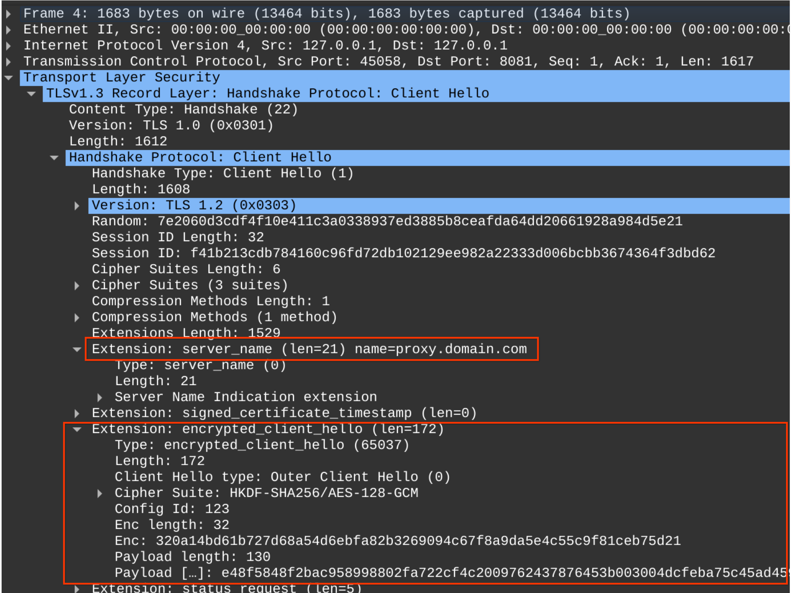
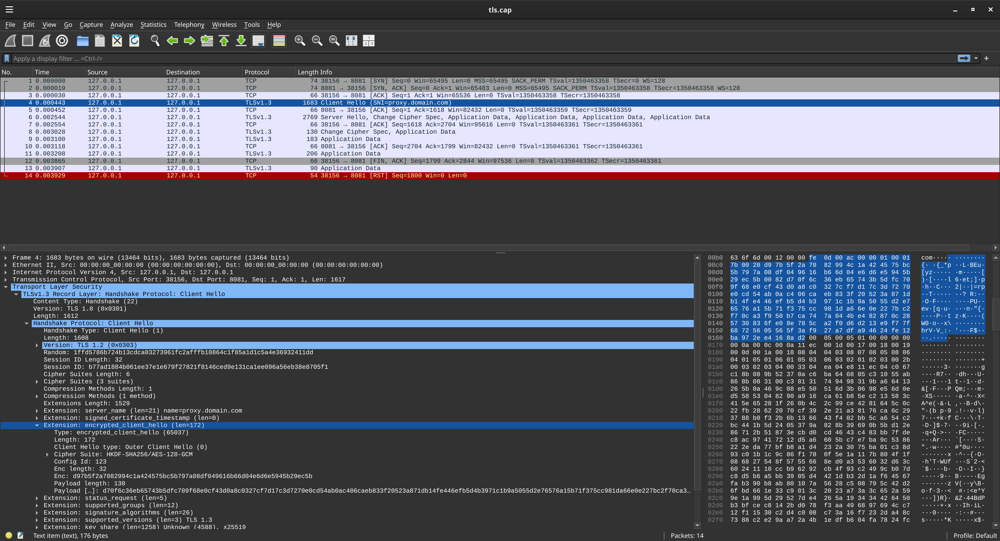

## Encrypted Client Hello (ECH) with Go

Simple go TLS client/server which demonstrates [TLS Encrypted Client Hello: draft-ietf-tls-esni-22](https://datatracker.ietf.org/doc/draft-ietf-tls-esni/).

Basically, ECH allows you hide the "ClientHello" message which usually includes SNI information about which server you are making the request for.

Instead of transmitting the SNI in the ClientHello, ECH allows you to encrypt that information while only divulging the "proxy" you are connecting to.

For more information, see

[Encrypted Client Hello - the last puzzle piece to privacy](https://blog.cloudflare.com/announcing-encrypted-client-hello/)
[Quick set up guide for Encrypted Client Hello (ECH)](https://guardianproject.info/2023/11/10/quick-set-up-guide-for-encrypted-client-hello-ech/)

In this repo, you will need `go1.24+`

```bash
$ go version
  go version go1.24rc1 linux/amd64
```

and will run

1. Server which runs TLS server hosting both `proxy.domain.com` and `backend.domain.com`
2. Client which loads ECH configuration information and ultimately connects to `backend.domain.com`.

Note that the client will first load the ECH configuration which instructs it to initially connect via SNI to  `proxy.domain.com` but at the same time, transmit an `encrypted_client_hello` message which includes information about the final destination to return the certificate for.  In this case, the final destination is `backend.domain.com`




Also see

- [X25519MLKEM768 client server in go](https://github.com/salrashid123/ml-kem-tls-keyexchange)
- [go: crypto/tls/ech.go](https://go.dev/src/crypto/tls/ech.go)

---

#### QuickStart

Just run the Server

```bash
$ go run server/main.go 
ECHConfig: /g0AR3sAIAAgjMl+K6smWKLfF3gidm5A7RUE+qG7DVNEwhxJs59TBHQADAABAAEAAQACAAEAAyAQcHJveHkuZG9tYWluLmNvbQAA
echConfigList Std: AEv+DQBHewAgACCMyX4rqyZYot8XeCJ2bkDtFQT6obsNU0TCHEmzn1MEdAAMAAEAAQABAAIAAQADIBBwcm94eS5kb21haW4uY29tAAA=
Starting Server..
SNI ServerName: backend.domain.com
```

And in a new window the client:

```bash
$ go run client/main.go 
ECHAccepted true
200 OK
ok
```

Note the client actually just connects backend as normal but provides the ECH parameters:

```golang
  hconfig = "AEv+DQBHewAgACCMyX4rqyZYot8XeCJ2bkDtFQT6obsNU0TCHEmzn1MEdAAMAAEAAQABAAIAAQADIBBwcm94eS5kb21haW4uY29tAAA="
  echConfigListBytes, err := base64.StdEncoding.DecodeString(hconfig)
	tlsConfig := &tls.Config{
		MinVersion: tls.VersionTLS13,
		MaxVersion: tls.VersionTLS13,
		ServerName: "backend.domain.com",
		RootCAs:    caCertPool,
		EncryptedClientHelloRejectionVerify: func(cs tls.ConnectionState) error {
			if !cs.ECHAccepted {
				return errors.New("ECH not accepted")
			}
			return nil
		},
		EncryptedClientHelloConfigList: echConfigListBytes,
	}

	tr := &http.Transport{
		TLSClientConfig: tlsConfig,
	}
	client := &http.Client{Transport: tr}

	resp, err := client.Get("https://backend.domain.com:8081")
```

So in the client needs to first set an `ECHConfigList` which is just a list of individual ECHConfiguration parameters defined in the RFCs which instruct the client to first contact the proxy.

Note: it was pretty challenging got create the configlist in go so i've setup a library/utility function of sorts in `ithub.com/salrashid123/go_ech/util` package

```golang
// Generates a serialized Encrypted Client Hello (ECH) configuration for a given domain
func GetECHConfig(privateKey *ecdh.PrivateKey, domain string) ([]byte, error) 

// Generates a serialized list of Encrypted Client Hello (ECH) configuration for a set of domains
func GetECHConfigList(privateKey *ecdh.PrivateKey, domains []string) ([]byte, error)
```

#### Trace

If you want to view the trace files, 

- With ECH

```bash
 wireshark ech.cap -otls.keylog_file:ech.keylog
```



- Without ECH

```bash
 wireshark noech.cap -otls.keylog_file:noech.keylog
```


To create new traces, set the env var and then run the client

```bash
 export SSLKEYLOGFILE=ech.keylog
 sudo tcpdump -s0 -ilo -w ech.cap "port 8081 and (host localhost)"
 wireshark ech.cap -otls.keylog_file:ech.keylog
```


### DNS

THis demo supplies the ECHConfig directly in code but as an alternative, you can also read it from `HTTPS` type records in DNS associated with the backend server.

You can also encrypt the DNS lookup calls for the final domain by using `"DNS over HTTP" (doh)`.

The following shows the DNS records for a test domain which you can use in this demo as well as one defined in `defo.ie`


```bash
$ dig +short A proxy.6equj5.dev 
127.0.0.1

$ dig +short A backend.6equj5.dev 
127.0.0.1

$ dig +short https backend.6equj5.dev 
1 . ech=AEv+DQBHewAgACCMyX4rqyZYot8XeCJ2bkDtFQT6obsNU0TCHEmzn1MEdAAMAAEAAQABAAIAAQADIBBwcm94eS42ZXF1ajUuZGV2AAA=

AEv+DQBHewAgACCMyX4rqyZYot8XeCJ2bkDtFQT6obsNU0TCHEmzn1MEdAAMAAEAAQABAAIAAQADIBBwcm94eS42ZXF1ajUuZGV2AAA=
AED+DQA89QAgACAIsHEHdG2yCKwEhxwtNP2aMGzy1N/hdcQErLhelFWFegAEAAEAAQANY292ZXIuZGVmby5pZQAA

$  dig +short https defo.ie
1 . ipv4hint=213.108.108.101 ech=AED+DQA89QAgACAIsHEHdG2yCKwEhxwtNP2aMGzy1N/hdcQErLhelFWFegAEAAEAAQANY292ZXIuZGVmby5pZQAA ipv6hint=2a00:c6c0:0:116:5::10
```

---

#### Openssl with ECH

Openssl feature brach also has a utility function to generate a key and config.  I haven't used this mode in this repo but to set that up:

```bash
git clone https://github.com/openssl/openssl.git --branch feature/ech
./Configure --prefix=/apps/openssl3.5.0/
make -j`nproc`
make install
# openssl ech -public_name proxy.6equj5.dev -out proxy.6equj5.pem.ech
```

#### curl with ECH

If you compiled openssl with the ech feature, you can also build curl with ECH support:

see: [Building curl with HTTPS-RR and ECH support](https://github.com/curl/curl/blob/master/docs/ECH.md)

```bash
$ openssl version
  OpenSSL 3.5.0-dev  (Library: OpenSSL 3.5.0-dev )

$ curl --version
  curl 8.12.0-DEV (x86_64-pc-linux-gnu) libcurl/8.12.0-DEV OpenSSL/3.5.0 zlib/1.3.1 libpsl/0.21.2 nghttp2/1.61.0
      Release-Date: [unreleased]
      Protocols: dict file ftp ftps gopher gophers http https imap imaps ipfs ipns mqtt pop3 pop3s rtsp smb smbs smtp smtps telnet tftp ws wss
      Features: alt-svc AsynchDNS ECH HSTS HTTP2 HTTPS-proxy IPv6 Largefile libz NTLM PSL SSL threadsafe TLS-SRP UnixSockets

curl --cacert certs/root-ca.crt --ech hard --doh-url https://dns.google/dns-query https://backend.6equj5.dev:8081/

curl --cacert certs/root-ca.crt \
  --ech "ecl:AEv+DQBHewAgACCMyX4rqyZYot8XeCJ2bkDtFQT6obsNU0TCHEmzn1MEdAAMAAEAAQABAAIAAQADIBBwcm94eS42ZXF1ajUuZGV2AAA=" \
   --doh-url https://dns.google/dns-query https://backend.6equj5.dev:8081/
```


 


